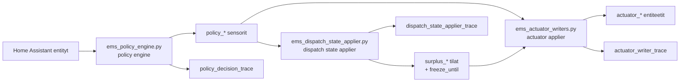

# EMS-arkkitehtuuri

## Tarkoitus

Tama dokumentti kuvaa projektin nykyarkkitehtuurin. Kuvaus perustuu erityisesti tiedostoihin `ems_policy_engine.py`, `ems_dispatch_state_applier.py`, `ems_actuator_writers.py` ja `modules/ems_core/*`.

Projektin ydin on kolmen paakomponentin ketju:

1. policy engine laskee EMS:n tavoiteohjaukset
2. surplus dispatch state applier paivittaa sisaiset aktiivisuuslukot
3. actuator applier kirjoittaa lopulliset ohjaukset Home Assistantin aktuaattoreille

Nykyinen tuotantotila perustuu `policy_*`, `actuator_*` ja `surplus_*`-entiteetteihin.

## Kokonaiskuva

## Paakomponentit

### 1. Policy Engine

Tiedosto: `ems_policy_engine.py`

Vastuut:

1. lukee konfiguraation `EmsConfig`-malliin
2. lukee aktiiviset profiilit `Profiles`-malliin
3. lukee mittaukset `RuntimeMeasurements`-malliin
4. arvioi guard-tilan `evaluate_guard()`-funktion kautta
5. lukee HAEO-ennusteen tilan ja tuoreuden
6. laskee net zero -moottorin ulostulot `compute_net_zero_engine_outputs()`-funktion kautta
7. julkaisee `policy_*`-sensorit ja diagnostiikka-attribuutit

Koodin triggerit:

1. `@time_trigger('period(now, 30s)')`
2. `@state_trigger(...)` profiili- ja mittausentiteeteille

Julkaistavat keskeiset policy-entiteetit:

1. `policy_battery_target_w`
2. `policy_ev_current_a`
3. `policy_relay1_command`
4. `policy_relay2_command`
5. `policy_decision_trace`
6. `surplus_policy_active_pys`
7. `surplus_next_target_pys`
8. `surplus_next_threshold_pys`
9. `surplus_release_candidate_pys`
10. `surplus_explanation_pys`
11. `surplus_dispatch_decision_pys`

### 2. Dispatch State Applier

Tiedosto: `ems_dispatch_state_applier.py`

Vastuut:

1. lukee policy engine -komponentin tuottaman dispatch-paatoeksen
2. muuntaa `ACTIVATE_*`, `RELEASE_*` ja `CLEAR_ALL` -paatokset sisaisiksi `surplus_*_active`-tiloiksi
3. kirjoittaa `surplus_freeze_until`-ajan `input_datetime`-entiteettiin
4. julkaisee `sensor.ems_dispatch_state_applier_trace`-diagnostiikan

Tama komponentti ei tee optimointia itse, vaan toteuttaa policy engine -komponentin paatoksen tilamuutoksiksi.

### 3. Actuator Applier

Tiedosto: `ems_actuator_writers.py`

Vastuut:

1. kirjoittaa akun setpointin `actuator_victron_setpoint_w`-entiteettiin
2. kirjoittaa EV-laturin paalle/pois-tilan ja virran `actuator_ev_enabled` ja `actuator_ev_current_a` -entiteetteihin
3. kirjoittaa releiden paalle/pois-komennot `actuator_relay1` ja `actuator_relay2` -entiteetteihin
4. julkaisee `sensor.ems_actuator_writer_trace`-diagnostiikan

Actuator applier toimii policy-entiteettien perusteella. Akkuwriterissa policy-attribuutin `battery_write_enabled` rooli on erityisen tarkea.

EV-writerissa policy-attribuutti `ev_policy_mode` erottaa kaksi eri `0 A`-semantiikkaa:

1. `ev_policy_mode == hard_off` -> laturi kytketaan pois paalta, mutta current-selector pidetaan hardware-minimissa
2. muu `0 A` -> surplus release -semantiikka, jossa virta palautetaan minimiin vain jos laturi on jo paalla

## Domain-mallit

Tiedosto: `modules/ems_core/domain/models.py`

Projektin keskeiset mallit:

1. `Profiles`
2. `EmsConfig`
3. `RuntimeMeasurements`
4. `HaeoTargets`
5. `NetZeroState`
6. `SurplusTargetConfig`
7. `SurplusDispatchInput`
8. `SurplusDispatchDecision`
9. `NetZeroOutputs`

### Profiilit

`ControlProfile`:

1. `MANUAL`
2. `MANUAL_SAFE`
3. `AUTOMATIC`
4. `HORIZON_BY_HAEO`

`GoalProfile`:

1. `NET_ZERO`
2. `MAX_EXPORT`
3. `CHEAP_GRID_CHARGE`

`ForecastProfile`:

1. `NONE`
2. `HAEO`

`GuardProfile`:

1. `NORMAL_LIMITS`
2. `STRICT_LIMITS`
3. `BATTERY_PROTECT`
4. `DEGRADED`

## Entity-mappaus

Tiedosto: `modules/ems_adapter/entity_map.py`

Nykyinen mappaus kayttaa nimenomaan `actuator_*`- ja `surplus_*`-avaimia. Keskeiset ryhmat:

1. profiilit: `control_profile`, `goal_profile`, `forecast_profile`, `guard_profile`
2. konfiguraatio: `deadband_w`, `ramp_max_w`, `strict_limits_max_w`, `max_solar_charge_w`, `ev_*`, `relay*_power_kw`, `*_priority`
3. mittaukset: `soc`, `min_cell_voltage_v`, `grid_power_w`, `current_battery_sp`, `hourly_energy_balance`, `pv_power_kw`
4. HAEO: `haeo_battery_power_active`, `haeo_ev_battery_power_active`, freshness-lahteet
5. policy-ulostulot: `policy_*`
6. surplus-tilat: `surplus_freeze_until`, `surplus_ev_active`, `surplus_r1_active`, `surplus_r2_active`
7. aktuaattorit: `actuator_victron_setpoint_w`, `actuator_ev_current_a`, `actuator_ev_enabled`, `actuator_relay1`, `actuator_relay2`

## Guard-logiikka

Tiedosto: `modules/ems_core/guard/evaluator.py`

Guardin arviointi tapahtuu jokaisessa policy engine -ajokierroksessa.

### `STRICT_LIMITS`

Jos guard on kayttajan valitsema `STRICT_LIMITS`, evaluator ei overridea sita. Koodin syyteksti on: `STRICT_LIMITS is user selected; EMS will not override`.

### `DEGRADED`

`DEGRADED` aktivoituu, jos Victron/SOC-data on stale tai virheellinen:

1. `victron_heartbeat_age_s > victron_heartbeat_timeout_s`
2. SOC puuttuu tai ei ole valilla 0..100

Koodin syyteksti: `Victron/SOC data is stale or invalid`.

### `BATTERY_PROTECT`

`BATTERY_PROTECT` aktivoituu, jos jompikumpi tai molemmat ehdoista tayttyvat:

1. `soc < battery_protect_soc`
2. `min_cell_voltage_v < battery_protect_min_cell_voltage_v`

Palautuminen tapahtuu vain, jos molemmat palautumisehdot tayttyvat samanaikaisesti:

1. `soc >= battery_protect_soc + battery_protect_soc_recovery_margin`
2. `min_cell_voltage_v >= battery_protect_min_cell_voltage_v`

Tama kayttaytyminen on varmennettu myos skenaariotesteissa.

## Net zero -moottori

Tiedosto: `modules/ems_core/net_zero/engine.py`

Moottori yhdistaa profiilit, guard-tilan, HAEO:n, akun setpoint-laskennan, EV-strategian ja surplus-allokaation yhdeksi `NetZeroOutputs`-tulokseksi.

### Ennusteen roolit

`configured_forecast()`:

1. `MANUAL` ja `MANUAL_SAFE` pakottavat ennusteen `NONE`
2. `forecast_profile == HAEO` aktivoi HAEO-konfiguraation
3. `HORIZON_BY_HAEO` + `forecast_profile == NONE` aktivoi HAEO-konfiguraation

`effective_forecast()`:

1. HAEO on tehokkaasti kaytossa vain, jos se on konfiguroitu
2. ja freshness-ehto toteutuu

### Dominant limitation

Moottori julkaisee `dominant_limitation`-kenttan, jonka mahdollisia arvoja ovat esimerkiksi:

1. `SYSTEM_DEGRADED`
2. `BATTERY_SOC_LIMIT`
3. `USER_MANUAL_OVERRIDE`
4. `MANUAL_SAFE_ACTIVE`
5. `STRICT_POWER_LIMITS`
6. `FORECAST_FALLBACK_LOCAL`
7. `OPTIMIZATION_ACTIVE`

## Akkuohjauksen semantiikka

### `MANUAL`

`MANUAL`-tilassa moottori palauttaa nykyisen akun setpointin, mutta `battery_write_enabled` on `False`. Actuator applier ei siis kirjoita akulle.

### `MANUAL_SAFE`

`MANUAL_SAFE`-tilassa akun semantiikka on kaksiosainen:

1. normaalitilassa moottori palauttaa nykyisen akun setpointin ja `battery_write_enabled` on `False`
2. guard-tiloissa moottori voi clampata akun setpointia turvalliseen suuntaan ja samalla `battery_write_enabled` muuttuu `True`

Tarkemmat guard-vaikutukset:

1. `DEGRADED` -> akkutarget `0`
2. `BATTERY_PROTECT` -> akkutarget ei-negatiiviseksi
3. `STRICT_LIMITS` -> akkutarget `[-strict_limits_max_w, +strict_limits_max_w]`

### `NET_ZERO`

`NET_ZERO`-tilassa akun target lasketaan `candidate_sp_net_zero()`-funktion avulla. Laskenta kayttaa:

1. `rpnz_w`
2. `grid_actual_w`
3. nykyista akun setpointia
4. deadbandia
5. ramppirajaa
6. `max_solar_charge_w`-ylakattoa

### `MAX_EXPORT`

Ilman HAEO:ta akun paikallinen fallback on `-4000` W.

Jos HAEO on tehokkaasti kaytossa, akun target tulee suoraan `haeo.battery_target_kw`-ennusteesta wattimuotoon muunnettuna.

### `CHEAP_GRID_CHARGE`

Ilman HAEO:ta akun paikallinen fallback on `100` W.

Jos HAEO on tehokkaasti kaytossa, akun target tulee `haeo.battery_target_kw`-ennusteesta.

## EV-ohjauksen semantiikka

Tiedosto: `modules/ems_core/net_zero/load_projection.py`

### `MANUAL`

Jos `ev_force_current_a > 0`, sita kaytetaan suorana EV-ohjauksena, rajattuna `ev_max_current_a`:han. Muuten palautetaan `-1`, joka tarkoittaa skip-tilaa.

### `MANUAL_SAFE`

EV-semantiikka on koodikommentin mukaan sama kuin `MANUAL` "for now". Akkuun liittyva turvallisuus clampataan muualla.

### `DEGRADED`

`DEGRADED`-guard palauttaa EV:lle aina `-1`, eli writer ei tee aktiivista EV-ohjausta.

### `NET_ZERO`

`NET_ZERO`-tilassa `ev_force_current_a` toimii kayttajan minimipyyntona eli floorina, ellei guard muuta kayttaytymista.

Semantiikka:

1. jos `burn_active` on epatosi, perusvirta on `0`
2. jos `burn_active` on tosi, perusvirta on `ev_max_current_a`
3. jos `ev_force_current_a > 0`, lopputulos on vahintaan force-current mutta ei yli `ev_max_current_a`

Tama vastaa kaytannossa pyyntoa: force-current toimii kayttajan minimipyyntona, mutta ei esty guard-tilojen vaikutuksia.

### `MAX_EXPORT`

Nykyinen tuotantokoodi palauttaa `MAX_EXPORT`-tilassa EV-policyksi `0`.

Koodikommentti sanoo, etta `MAX_EXPORT means export-first: flexible EV charging must be off`.

Tama on nykyisen tuotantosemantiikan ydin. Yllapidon kannalta tama tarkoittaa tavoitetilana:

1. EV policy current `0`
2. charger disabled
3. current `0`
4. relays off

Nykyinen writer-toteutus tukee taman tavoitesemantiikan `hard_off`-attribuutilla.

### `CHEAP_GRID_CHARGE`

Semantiikka:

1. jos `ev_force_current_a > 0`, sita kunnioitetaan
2. muuten HAEO voi syottaa EV-kohdevirran `ev_kw_to_selector_current_a()`-funktion kautta
3. ilman forcea ja ilman HAEO:ta oletus on `ev_max_current_a`

### EV hard-off low-PV -kayttaytyminen

Tiedosto: `modules/ems_core/net_zero/engine.py` ja writer `ems_actuator_writers.py`.

Nykyinen tuotantoketju tukee EV:lle erillista low-PV hard-off -tilaa.

Semantiikka:

1. policy voi julkaista `policy_ev_current_a = 0`
2. samalla attribuutti `ev_policy_mode` voi olla `hard_off`
3. writer sammuttaa silloin laturin, mutta jattaa current-selectorin minimiin
4. attribuutti `ev_low_pv_cycles` kertoo montako matalan PV:n sykliä on kertynyt

## Releohjauksen semantiikka

Tiedosto: `modules/ems_core/net_zero/load_projection.py`

### `MANUAL` ja `MANUAL_SAFE`

Releet seuraavat suoraan `force_on`-tilaa:

1. `force_on=True` -> komento `1`
2. muuten komento `0`

### `DEGRADED`

Palauttaa `-1`, eli skip.

### `NET_ZERO`

Semantiikka:

1. `force_on=True` ohittaa muun logiikan -> `1`
2. jos import-zero ei ole sallittu -> `0`
3. jos `net_zero_active=True` -> `1`
4. muuten `0`

### `MAX_EXPORT` ja `CHEAP_GRID_CHARGE`

Kummassakin palautetaan `0`, eli releet ovat pois.

## Surplus-allokaatio

Tiedosto: `modules/ems_core/net_zero/surplus_allocator.py`

Allokaattori tekee prioriteettipohjaisen aktivointi- ja vapautuspaatoksen.

Peruskayttaytyminen:

1. jos policy ei ole aktiivinen -> `CLEAR_ALL`
2. jos aktiivinen kohde ei ole enaa kelvollinen -> vapauta se
3. jos `rpnz_w <= 0` ja aktiivisia kohteita on -> vapauta alin prioriteetti ensin
4. jos freeze on aktiivinen -> ei uusia aktivointeja
5. muuten aktivoi seuraava kohde, jos `rpc_kw >= threshold_kw`

Prioriteetti ja jarjestys:

1. `next_target()` valitsee suurimman prioriteetin, pienimman rankin kohteen
2. `release_target()` vapauttaa pienimman prioriteetin, suurimman rankin aktiivisen kohteen

Kokonaisuus on testattu useissa quarter-skenaarioissa.

## HAEO:n nykyinen rooli

Tiedosto: `modules/ems_core/integrations/haeo_horizon.py` ja moottorin forecast-kasittely `engine.py`:ssa.

Nykyinen koodista todennettava rooli:

1. forecastin tuoreuden tarkastus tapahtuu freshness-lahteiden viimeisimpien paivitysaikojen perusteella
2. akun HAEO-target voidaan lukea `haeo_battery_power_active`-entiteetin `forecast`-attribuutista
3. EV HAEO-target voidaan lukea `haeo_ev_battery_power_active`-entiteetin `forecast`-attribuutista
4. HAEO vaikuttaa akkusetpointiin `MAX_EXPORT`- ja `CHEAP_GRID_CHARGE`-tiloissa
5. HAEO vaikuttaa EV-ohjaukseen `CHEAP_GRID_CHARGE`-tilassa
6. `HORIZON_BY_HAEO` voi pakottaa forecast-konfiguraation HAEO:on vaikka `forecast_profile` olisi `NONE`

Tarkeaa: koodin perusteella HAEO ei tee taytta `NET_ZERO`-optimointia. `NET_ZERO`-tilassa seliteteksti on nimenomaan paikallisen policylogiikan hallitsema, vaikka HAEO olisi nakyvissa.

## Diagnostiikka ja observability

### `policy_decision_trace`

Tiedosto: `modules/ems_core/diagnostics/decision_trace.py`

Keskeisia attribuutteja:

1. `control`
2. `goal`
3. `forecast_profile`
4. `guard`
5. `effective_forecast`
6. `dominant_limitation`
7. `explanation`
8. `battery_target_w`
9. `battery_write_enabled`
10. `ev_current_a`
11. `relay1_command`
12. `relay2_command`
13. `surplus_policy_active`
14. `surplus_next_target`
15. `surplus_next_threshold_kw`
16. `surplus_release_candidate`
17. `surplus_dispatch_decision`
18. `surplus_explanation`
19. `configured_forecast`
20. `active_stack`
21. `surplus_freeze_until_ts`
22. `surplus_rpc_kw`
23. `surplus_rpnz_w`
24. `guard_reason`

### `actuator_writer_trace`

Sisaltaa omat haaransa:

1. `victron`
2. `ev`
3. `relay1`
4. `relay2`

### `dispatch_state_applier_trace`

Sisaltaa esimerkiksi:

1. `decision`
2. `writes`
3. `freeze_written`
4. `freeze_until_ts`
5. `relay1_active`
6. `ev_active`
7. `relay2_active`

## Goal-profile-valinta

EMS lukee goal-profiilin entiteetista `input_select.ems_goal_profile`.

## Nykyinen EV 0 A -semantiikka

Nykytilassa EV:n `0 A` policy jakautuu kahteen eri writer-polkuun:

1. `ev_policy_mode=hard_off` -> writer sammuttaa laturin ja palauttaa current-selectorin minimiin
2. ilman `hard_off`-attribuuttia -> writer tulkitsee tilanteen surplus release -polkuna ja palauttaa currentin minimiin vain jos laturi on jo paalla

Tama semantiikka on nyt linjassa nykyisten e2e-skenaarioiden kanssa.

## Avoimet kysymykset / jatkokehitys

1. Onko `ems_policy_engine.py`-nimeaminen ja rajapinta nyt lopullinen tuotantolinjaus?
2. Pitaako writeriin lisata erillinen eksplisiittinen EV hard-off -polku `MAX_EXPORT`-semantiikkaa varten?
3. Tarvitaanko erillinen `SAFE_OFF`- tai `PAUSED`-kayttotila tulevaisuudessa, jos halutaan yksi eksplisiittinen tapa pysayttaa EMS:n vaikutus ilman manuaalista aktuaattorikohtaista asetusta?
4. Sijaitseeko mahdollinen automaattinen goal switcher toisessa Home Assistant -konfiguraatiorepossa?
