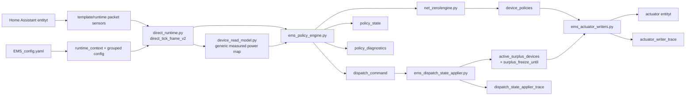
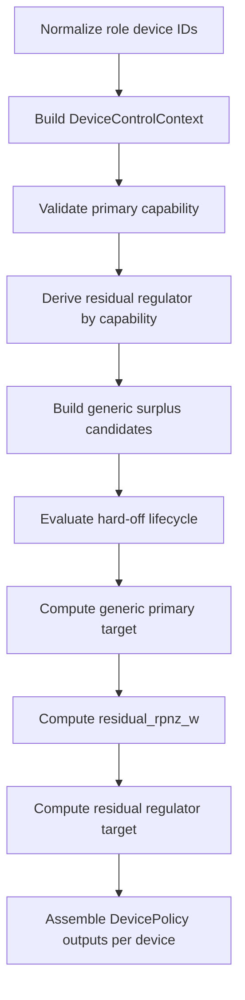

# EMS-arkkitehtuuri

## Tarkoitus

Tama dokumentti kuvaa nykyisen aktiivisen runtime-arkkitehtuurin. Kuvaus
vastaa erityisesti tiedostoja `ems_policy_engine.py`,
`ems_dispatch_state_applier.py`, `ems_actuator_writers.py`,
`modules/ems_adapter/direct_runtime.py`, `modules/ems_adapter/device_read_model.py`
ja `modules/ems_core/net_zero/engine.py`.

## Arkkitehtuurin perusperiaate

NET_ZERO erottaa seuraavat asiat toisistaan:

1. `kind` kertoo ensisijaisesti adapteri-/read-model-identiteetin
2. capabilities kertovat mita fyysinen laite voi tehda
3. role kertoo mita tehtavaa device tekee nykyisessa NET_ZERO-konfiguraatiossa
4. policy kertoo thresholdit, rajat, prioriteetin ja lifecycle-virityksen
5. lifecycle ratkaisee tilasiirtyman
6. `DevicePolicy` kertoo halutun `target_w` / enabled / mode / reason -tuloksen
7. adapter/writer muuntaa geneerisen targetin fyysiseksi komennoksi

Core-policy ei saa paatella geneerista primary- tai residual-kelpoisuutta
pelkasta `kind == EV_CHARGER` tai `kind == BATTERY` -ehdosta.

## Kanoninen tuotantoketju

EMS:n tuotantopolku on kolmevaiheinen:

1. policy engine laskee policy-payloadit
2. dispatch state applier paivittaa aktiiviset surplus-tilat
3. actuator writer kirjoittaa lopulliset aktuaattorikomennot

Kanoniset runtime-outputit ovat:

1. `sensor.ems_device_policies_pyscript`
2. `sensor.ems_surplus_dispatch_command_pyscript`
3. `sensor.ems_policy_state_pyscript`

Diagnostiikka-outputit ovat:

1. `sensor.ems_policy_diagnostics_pyscript`
2. `sensor.ems_actuator_writer_trace`
3. `sensor.ems_dispatch_state_applier_trace`

`policy_diagnostics` on vain selitys- ja debug-pinta. Sita ei saa kayttaa
command/state-lahteena.

## Kokonaiskuva

## Direct-v2 runtime contract

Tuotantopolku on `direct_tick_frame_v2` / schema version `2`.

Policy-config packetissa jokaiselta devicelta vaaditaan eksplisiittisesti:

1. `uses_hard_off_lifecycle: bool`
2. `supports_primary_regulation: bool`
3. `supports_residual_regulation: bool`

Direct-v2 parseri validoi nama strict booleaneina. Esimerkiksi string `"true"`
ja numerot `0`/`1` eivat ole valideja boolean-arvoja.

Role-validointi tapahtuu ennen core-laskentaa:

1. eksplisiittisesti sama primary- ja surplus-device hylataan
2. primaryn on tuettava `supports_primary_regulation=true`
3. residual-regulaattorin on loydyttava capabilityjen perusteella

Invalidi yhdistelma kayttaa olemassa olevaa kontrolloitua runtime-invalid/fail-closed
polkua; sita ei korjata EV/BATTERY cross-combo fallbackilla.

## NET_ZERO core execution

Sisaiset roolit ovat:

1. `primary_device_id`
2. `surplus_adjustable_device_id`
3. `residual_regulator_device_id`

Residual-regulaattori johdetaan seuraavasti:

1. jos primary tukee `supports_residual_regulation=true`, residual = primary
2. muuten jos surplus-adjustable tukee sita, residual = surplus-adjustable
3. muuten yhdistelma on invalidi

## DeviceControlContext

Core-facing `DeviceControlContext` sisaltaa:

1. `device_id`
2. `kind`
3. `can_absorb_w`
4. `can_produce_w`
5. `min_absorb_w`
6. `max_absorb_w`
7. `max_produce_w`
8. `step_w`
9. `supports_primary_regulation`
10. `supports_residual_regulation`
11. `uses_hard_off_lifecycle`
12. `priority`
13. `current_measured_power_w`

Geneerinen primary-target laskenta ei tarvitse EV:n `current_a`, `phases` tai
`voltage_v` -kenttia. Tuotannon read-model muodostaa corelle geneerisen
measured-power-mapin. Engine sisaltaa viela EV-mittauksen compatibility-fallbackin,
jos primary-EV:n geneerinen measured-power-arvo puuttuu; tuotantopolun tavoite on
syottaa arvo read-modelista.

## Primary target ja adapteriraja

Geneerinen absorb-only stepped primary -laskenta kayttaa:

1. requested envelope
2. `min_absorb_w`
3. `max_absorb_w`
4. `step_w`

`quantize_absorb_target_w()` ja `compute_primary_device_target_w()` eivat tarvitse
EV:n ampeerikenttia. EV:n A x phases x V -muunnos kuuluu adapteri/read-model
-semantiiikkaan.

## Hard-off lifecycle

`compute_hard_off_lifecycle_transition()` on role-independent transition helper.
Nykyinen production-kardinaliteetti arvioi selected-single lifecycle-EV:n, mutta
sama transition-sopimus koskee sita riippumatta siita onko se primary vai
surplus-adjustable.

Authoritative jatkuvuustila on:

- `previous_device_states[device_id]`

Release recovery vaatii nykyisessa toteutuksessa:

1. PV >= `low_pv_threshold_w`
2. RPC >= callerin eksplisiittisesti antama release threshold
3. ei battery-to-device loop-riskiä
4. ehto tayttyy `hard_off_release_cycles` perakkaisella kierroksella

Katkeava recovery nollaa release-counterin. Yksittainen RPC-kynnyksen ylitys ei
saa ohittaa counteria.

Nykyinen EV-policy antaa thresholdin roolin mukaan:

1. surplus-adjustable EV: explicit `adjustable_surplus_activation_w`
2. primary EV: EV:n minimi absorbointiteho

Rooli voi siis vaikuttaa policy-input-thresholdiin, mutta ei siihen sovelletaanko
perakkaisten kierrosten release-countia.

## Komponentit

### Policy Engine

Tiedosto: `ems_policy_engine.py`

Vastuut:

1. lukee direct-v2 runtime packetit
2. muodostaa runtime-faktat ja geneerisen measured-power-kontekstin
3. arvioi guard-tilan
4. laskee `NetZeroOutputs`-ulostulon
5. julkaisee `device_policies`, `dispatch_command` ja `policy_state`
6. julkaisee `policy_diagnostics`-selityspayloadin throttlatulla timer-cadencella

Ajastusmalli:

1. Pyscript scheduler kutsuu policy-engine tickia kiinteasti `2s` valein
2. `ems.policy_engine.interval_seconds` maarittaa minimi elapsed intervalin
3. kevyt skip-polku ei lue configia, runtime-contextia tai entityja
4. runtime-inputit luetaan oikean policy-ajon alussa
5. config interval -muutos voi tulla voimaan seuraavassa oikeassa ajossa tai manual/reload-ajossa

Julkaisusopimus:

1. `device_policies` sensorin `state` on muutoksesta eteneva monotonic version
2. `dispatch_command` sensorin `state` on muutoksesta eteneva monotonic version
3. `policy_state` sensorin `state` on muutoksesta eteneva monotonic version
4. versionumero etenee vain kyseisen canonical payloadin muuttuessa
5. varsinainen payload on attribuuteissa
6. `policy_diagnostics` julkaistaan timer-ajossa heti canonical outputin tai warning/input-quality-tilan muuttuessa, muuten enintaan konfiguroidulla cadenceella

### Dispatch State Applier

Tiedosto: `ems_dispatch_state_applier.py`

Vastuut:

1. lukee dispatch-paatoksen vain `dispatch_command`-sensorista
2. paivittaa `active_surplus_devices`-tilan
3. kirjoittaa `surplus_freeze_until`-ajan
4. julkaisee `dispatch_state_applier_trace`-diagnostiikan

Jos `dispatch_command` puuttuu tai on invalidi, kayttaytyminen on eksplisiittinen
safe `NOOP`.

### Actuator Writer

Tiedosto: `ems_actuator_writers.py`

Vastuut:

1. lukee laitekohtaiset policyt vain `device_policies`-sensorista
2. kirjoittaa akun setpointin
3. kirjoittaa EV-laturin enabled/current-arvot
4. kirjoittaa releiden on/off-tilat
5. julkaisee `actuator_writer_trace`-diagnostiikan

Writer ei lue `policy_diagnostics`-payloadia fallbackina.

## Konfiguraatiosopimus

Kanoninen grouped config -sopimus erottaa read targetit ja output-pinnat:

1. `runtime.*` entity-id:t ovat kayttajan konfiguroitavia read target -pintoja
2. canonical policy output -sensorit ovat kiinteasti koodissa
3. canonical diagnostics-outputit ovat kiinteasti koodissa
4. `ems.policy_outputs` ja `ems.diagnostics_outputs` hylataan eksplisiittisesti
5. capability ja policy ovat eri asioita: boolean capability ei kanna thresholdia tai cycle-maaraa

## Diagnostiikka

Keskeiset capability-driven NET_ZERO -kentat ovat:

1. `primary_device_id`
2. `surplus_adjustable_device_id`
3. `residual_regulator_device_id`
4. `primary_device_target_w`
5. `residual_rpnz_w`
6. `primary_surplus_combo_valid`
7. `primary_surplus_combo_reason`
8. `device_lifecycle_states`
9. `hard_off_lifecycle_devices`
10. `previous_device_states`

Legacy EV -kenttia voidaan julkaista compatibility-nakymina, mutta ne eivat ole
erillinen authoritative lifecycle-store.
