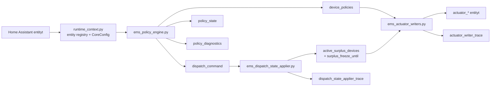

# EMS-arkkitehtuuri

## Tarkoitus

Tama dokumentti kuvaa nykyisen aktiivisen runtime-arkkitehtuurin. Kuvaus
vastaa tiedostoja `ems_policy_engine.py`, `ems_dispatch_state_applier.py`,
`ems_actuator_writers.py` ja `modules/ems_adapter/runtime_context.py`.

## Kanoninen tuotantoketju

EMS:n tuotantopolku on kolmevaiheinen:

1. policy engine laskee policy-payloadit
2. dispatch state applier paivittaa aktiiviset surplus-tilat
3. actuator writer kirjoittaa lopulliset aktuaattorikomennot

Kanoniset runtime-outputit ovat:

1. `sensor.ems_device_policies_pyscript`
2. `sensor.ems_surplus_dispatch_command_pyscript`
3. `sensor.ems_policy_state_pyscript`

Diagnostiikka-outputit ovat:

1. `sensor.ems_policy_diagnostics_pyscript`
2. `sensor.ems_actuator_writer_trace`
3. `sensor.ems_dispatch_state_applier_trace`

`policy_diagnostics` on vain selitys- ja debug-pinta. Sita ei saa kayttaa
command/state-lahteena.

`runtime.*` entity-id:t ovat kayttajan konfiguroitavia read target -pintoja.
`policy_outputs` ja `diagnostics_outputs` eivat ole enaa kayttajakonfiguraatiota,
vaan EMS:n kiinteita canonical output bus- ja diagnostics-pintoja.

## Kokonaiskuva

## Komponentit

### Policy Engine

Tiedosto: `ems_policy_engine.py`

Vastuut:

1. lukee `CoreConfig`-konfiguraation runtime_contextin kautta
2. lukee profiilit ja mittaukset
3. arvioi guard-tilan
4. laskee `NetZeroOutputs`-ulostulon
5. julkaisee `device_policies`, `dispatch_command` ja `policy_state`
6. julkaisee `policy_diagnostics`-selityspayloadin throttlatulla timer-cadencella

Ajastusmalli:

1. Pyscript scheduler kutsuu policy-engine tickia kiinteasti `2s` valein
2. `ems.policy_engine.interval_seconds` maarittaa minimi elapsed intervalin
3. kevyt skip-polku ei lue configia, runtime-contextia tai entityja
4. runtime-inputit luetaan oikean policy-ajon alussa grouped-configin entity-id:ista
5. config interval -muutos voi tulla voimaan seuraavassa oikeassa ajossa tai manual/reload-ajossa
6. raw runtime entityt eivat ole enaa policy-enginen `@state_trigger`-sopimus

Julkaisusopimus:

1. `device_policies` sensorin `state` on `device_policies_hash`
2. `dispatch_command` sensorin `state` on `dispatch_command_hash`
3. `policy_state` sensorin `state` on `policy_state_hash`
4. `policy_diagnostics` julkaistaan timer-ajossa heti canonical outputin tai warning/input-quality-tilan muuttuessa, muuten enintaan `ems.policy_engine.diagnostics_interval_seconds`-cadencella
5. manual- ja E2E-ajot julkaisevat `policy_diagnostics`-payloadin aina
6. varsinainen payload on attribuuteissa

### Geneerinen surplus-kandidaattipooli

`NET_ZERO`-enginen surplus-polku ei valitse ensin yhta adjustable-laitetta. Pooli
rakennetaan kaikista konfiguroiduista laitteista, jotka tayttavat laitekohtaisen
sopimuksen:

1. `capabilities.can_absorb_w = true`
2. `policy.surplus_allowed = true`
3. runtime availability/enable-ehdot sallivat osallistumisen
4. capability- tai lifecycle-tila ei tee targetista kelvotonta

Kandidaatin authoritative policy-kentat ovat `priority`,
`activation_threshold_w` ja `surplus_dispatch_mode`. Tuetut dispatch-modet ovat
`max_absorb` ja `fixed`. Core builder/allocator ei kysy laitteen kindia eika sita,
onko laite legacy `adjustable_surplus_load`. EV-, relay- ja muut absorb-capable
kandidaatit ovat samassa strict-priority-jarjestyksessa.

`primary_device_id` sailyy singular control role -kasitteena. Primary-only-
regulaattoria ei dispatchata toista kertaa poolista. Nykyinen laite, joka tukee
seka primary- etta residual-regulaatiota, voi sailyttaa tuotannon overlap-
semantiikan, jos sen oma `surplus_allowed` policy sallii osallistumisen; lopullinen
`DevicePolicy`-omistus pysyy yhtena.

Lifecycle on device-owned: `previous_device_states[device_id]` on authoritative.
Jokainen eligible `uses_hard_off_lifecycle=true` -laite arvioidaan itsenaisesti,
myos silloin kun toinen EV on aktiivisempi tai korkeammalla prioriteetilla.
Consecutive release -laskurit etenevat ja nollautuvat device-kohtaisesti.

Generic diagnostics:

1. `surplus_candidate_device_ids`
2. `surplus_candidate_stack`
3. `surplus_active_device_ids`
4. `surplus_next_device_id`
5. `surplus_release_device_id`
6. `surplus_targets_by_device_id`

`adjustable_surplus_load`, `adjustable_surplus_activation_w`,
`surplus_adjustable_device_id` ja `selected_ev_device_id` ovat tarvittaessa
compatibility-pintoja. Ne eivat ole generic candidate poolin execution truth
source. `selected_ev_device_id` johdetaan deterministisesti: primary-EV ensin,
muuten legacy EV-alias, muuten ensimmainen konfiguroitu EV.

### Dispatch State Applier

Tiedosto: `ems_dispatch_state_applier.py`

Vastuut:

1. lukee dispatch-paatoksen vain `dispatch_command`-sensorista
2. paivittaa `active_surplus_devices`-tilan
3. kirjoittaa `surplus_freeze_until`-ajan
4. julkaisee `dispatch_state_applier_trace`-diagnostiikan

Jos `dispatch_command` puuttuu tai on invalidi, kayttaytyminen on eksplisiittinen
safe `NOOP`.

### Actuator Writer

Tiedosto: `ems_actuator_writers.py`

Vastuut:

1. lukee laitekohtaiset policyt vain `device_policies`-sensorista
2. kirjoittaa akun setpointin
3. kirjoittaa EV-laturin enabled/current-arvot
4. kirjoittaa releiden on/off-tilat
5. julkaisee `actuator_writer_trace`-diagnostiikan

Writer ei lue `policy_diagnostics`-payloadia fallbackina.

## Runtime entity registry

Tiedosto: `modules/ems_adapter/runtime_context.py`

Kanoniset runtime-avaimet:

1. `device_policies`
2. `dispatch_command`
3. `policy_state`
4. `policy_diagnostics`
5. `actuator_writer_trace`
6. `dispatch_state_applier_trace`
7. `active_surplus_devices`
8. `previous_device_state`
9. `surplus_freeze_until`

Legacy-trace- ja standalone surplus summary -avaimia ei exposeerata aktiivisessa
registryssa.

## Konfiguraatiosopimus

Kanoninen grouped config -sopimus erottaa read targetit ja output-pinnat:

1. `runtime.*` entity-id:t ovat kayttajan konfiguroitavia read target -pintoja
2. canonical policy output -sensorit ovat kiinteasti koodissa
3. canonical diagnostics-outputit ovat kiinteasti koodissa
4. `ems.policy_outputs` ja `ems.diagnostics_outputs` hylataan eksplisiittisesti

## Diagnostiikkamoduuli

Tiedosto: `modules/ems_core/diagnostics/policy_diagnostics.py`

Diagnostiikkapayload sisaltaa selitys- ja seurantakenttia kuten:

1. `device_policies`
2. `surplus_device_dispatch_action`
3. `surplus_device_dispatch_target`
4. `surplus_device_dispatch_device_id`
5. `surplus_device_targets`
6. `surplus_explanation`
7. `config_source`
8. `policy_output_contract`

Se ei ole erillinen command-bus eika state-bus.
