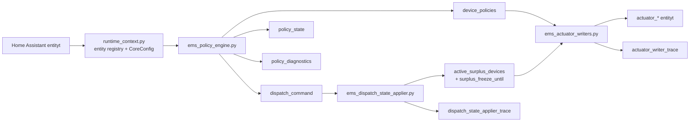

# EMS-arkkitehtuuri

## Tarkoitus

Tama dokumentti kuvaa nykyisen aktiivisen runtime-arkkitehtuurin. Kuvaus
vastaa tiedostoja `ems_policy_engine.py`, `ems_dispatch_state_applier.py`,
`ems_actuator_writers.py` ja `modules/ems_adapter/runtime_context.py`.

## Kanoninen tuotantoketju

EMS:n tuotantopolku on kolmevaiheinen:

1. policy engine laskee policy-payloadit
2. dispatch state applier paivittaa aktiiviset surplus-tilat
3. actuator writer kirjoittaa lopulliset aktuaattorikomennot

Kanoniset runtime-outputit ovat:

1. `policy_outputs.device_policies`
2. `policy_outputs.dispatch_command`
3. `policy_outputs.policy_state`

Diagnostiikka-outputit ovat:

1. `diagnostics_outputs.policy_diagnostics`
2. `diagnostics_outputs.actuator_writer_trace`
3. `diagnostics_outputs.dispatch_state_applier_trace`

`policy_diagnostics` on vain selitys- ja debug-pinta. Sita ei saa kayttaa
command/state-lahteena.

## Kokonaiskuva



## Komponentit

### Policy Engine

Tiedosto: `ems_policy_engine.py`

Vastuut:

1. lukee `CoreConfig`-konfiguraation runtime_contextin kautta
2. lukee profiilit ja mittaukset
3. arvioi guard-tilan
4. laskee `NetZeroOutputs`-ulostulon
5. julkaisee `device_policies`, `dispatch_command` ja `policy_state`
6. julkaisee `policy_diagnostics`-selityspayloadin

Julkaisusopimus:

1. `device_policies` sensorin `state` on `device_policies_hash`
2. `dispatch_command` sensorin `state` on `dispatch_command_hash`
3. `policy_state` sensorin `state` on `policy_state_hash`
4. varsinainen payload on attribuuteissa

### Dispatch State Applier

Tiedosto: `ems_dispatch_state_applier.py`

Vastuut:

1. lukee dispatch-paatoksen vain `dispatch_command`-sensorista
2. paivittaa `active_surplus_devices`-tilan
3. kirjoittaa `surplus_freeze_until`-ajan
4. julkaisee `dispatch_state_applier_trace`-diagnostiikan

Jos `dispatch_command` puuttuu tai on invalidi, kayttaytyminen on eksplisiittinen
safe `NOOP`.

### Actuator Writer

Tiedosto: `ems_actuator_writers.py`

Vastuut:

1. lukee laitekohtaiset policyt vain `device_policies`-sensorista
2. kirjoittaa akun setpointin
3. kirjoittaa EV-laturin enabled/current-arvot
4. kirjoittaa releiden on/off-tilat
5. julkaisee `actuator_writer_trace`-diagnostiikan

Writer ei lue `policy_diagnostics`-payloadia fallbackina.

## Runtime entity registry

Tiedosto: `modules/ems_adapter/runtime_context.py`

Kanoniset runtime-avaimet:

1. `device_policies`
2. `dispatch_command`
3. `policy_state`
4. `policy_diagnostics`
5. `actuator_writer_trace`
6. `dispatch_state_applier_trace`
7. `active_surplus_devices`
8. `previous_device_state`
9. `surplus_freeze_until`

Legacy-trace- ja standalone surplus summary -avaimia ei exposeerata aktiivisessa
registryssa.

## Konfiguraatiosopimus

Kanoninen grouped config -muoto:

```yaml
ems:
  policy_outputs:
    device_policies: sensor.ems_device_policies_pyscript
    dispatch_command: sensor.ems_surplus_dispatch_command_pyscript
    policy_state: sensor.ems_policy_state_pyscript

  diagnostics_outputs:
    policy_diagnostics: sensor.ems_policy_diagnostics_pyscript
    actuator_writer_trace: sensor.ems_actuator_writer_trace
    dispatch_state_applier_trace: sensor.ems_dispatch_state_applier_trace
```

Seuraavat legacy-kentat hylataan eksplisiittisesti:

1. legacy policy trace -alias
2. `policy_outputs.actuator_writer_trace`
3. `policy_outputs.dispatch_state_applier_trace`
4. standalone surplus summary -kentat

## Diagnostiikkamoduuli

Tiedosto: `modules/ems_core/diagnostics/policy_diagnostics.py`

Diagnostiikkapayload sisaltaa selitys- ja seurantakenttia kuten:

1. `device_policies`
2. `surplus_device_dispatch_action`
3. `surplus_device_dispatch_target`
4. `surplus_device_dispatch_device_id`
5. `surplus_device_targets`
6. `surplus_explanation`
7. `config_source`
8. `policy_output_contract`

Se ei ole erillinen command-bus eika state-bus.
