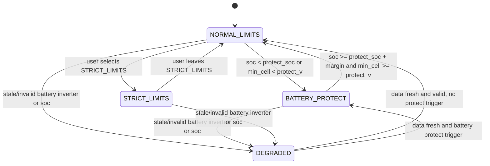
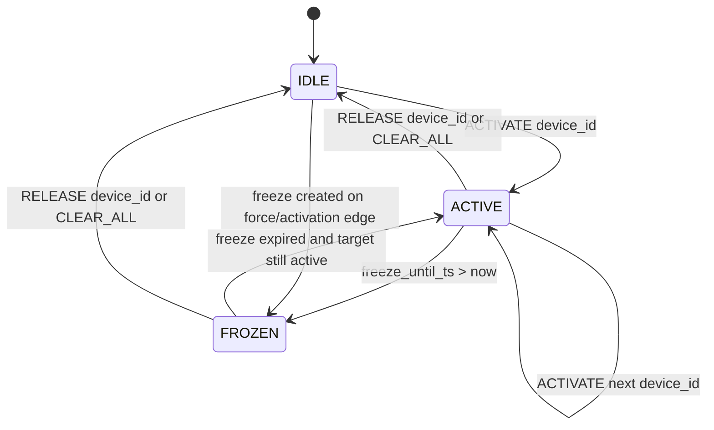
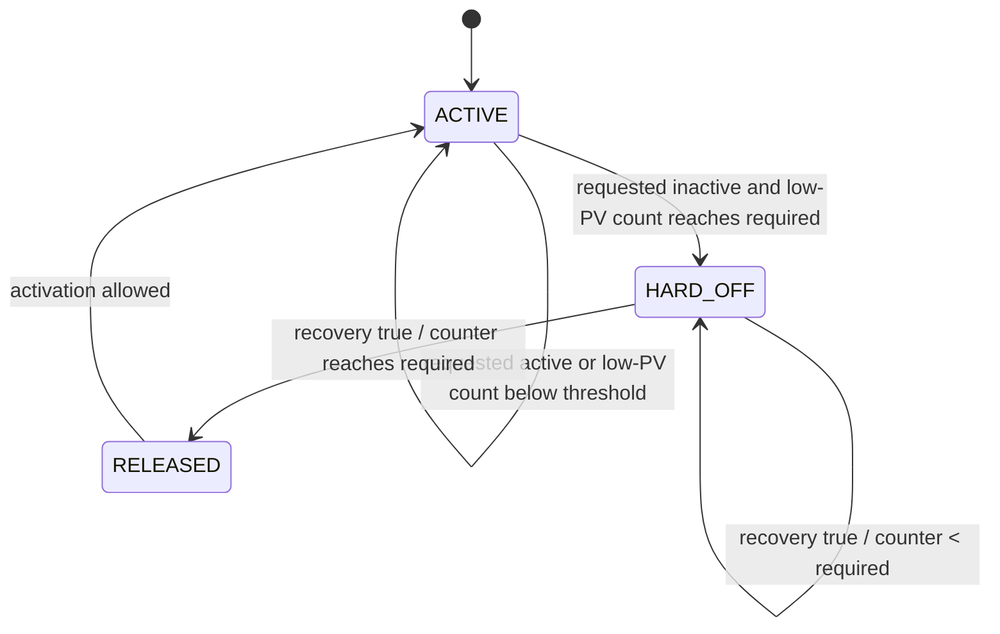
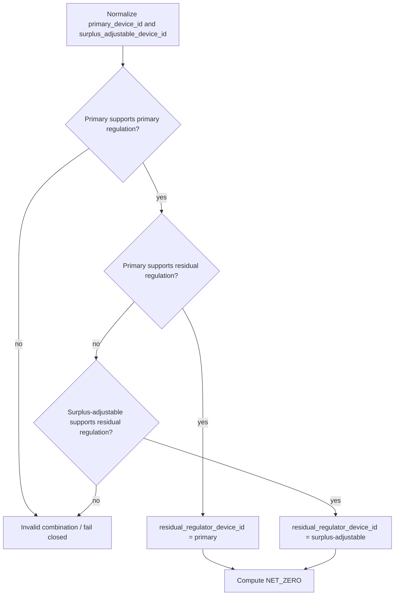
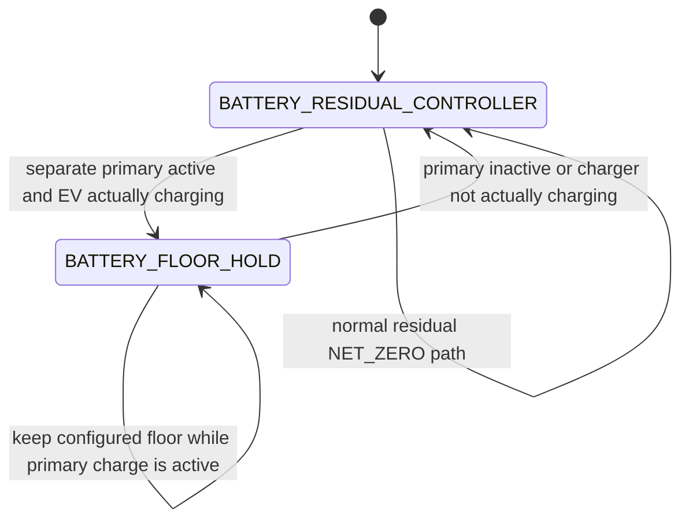

# EMS Tilakaavio

Tama dokumentti kokoaa yhteen EMS:n keskeiset tilasiirtymat:

1. Guard-profiilien operaatiotilat
2. Surplus-dispatch-statejen paasiirtymat
3. Capability-driven hard-off lifecycle
4. NET_ZERO role- ja residual-regulaattorin valinta
5. Primary-device + battery-target authority nykyisessa EV/BATTERY-tuessa

## 1) Guard-tilojen kaavio

## 2) Surplus-dispatch-statejen kaavio

Tulkitse kaavio nain:

1. `ACTIVATE` nostaa kanonisen `device_id`-kohteen aktiiviseksi.
2. `RELEASE` ja `CLEAR_ALL` pudottavat aktiivisuuden.
3. `FROZEN` estaa uusia aktivointeja freeze-ikkunan ajan.
4. Priority kuuluu fyysiselle devicelle, ei adjustable-roolille.
5. Practical-zero release voi syntya kun `rpnz_w <= 10 W`.

## 3) Capability-driven hard-off lifecycle

Recovery-condition nykyisessa toteutuksessa:

1. PV on tunnettu ja `pv_power_w >= low_pv_threshold_w`
2. `rpc_w >= release_rpc_threshold_w`
3. battery-to-device loop-riski ei ole aktiivinen

Oleellinen sopimus:

1. `hard_off_release_ready_cycles` kasvaa vain perakkaisilla recovery-kierroksilla
2. yksikin false recovery -kierros nollaa laskurin
3. yksittainen RPC-kynnyksen ylitys ei vapauta hard-offia
4. sama laskurisopimus koskee lifecycle-devicea primary- ja surplus-adjustable-roolissa
5. authoritative state on `previous_device_states[device_id]`

Nykyinen selected-single EV -production policy syottaa release-thresholdin nain:

1. surplus-adjustable EV: `adjustable_surplus_activation_w`
2. primary EV: EV:n minimi absorbointiteho

Threshold-input voi siis erota roolin mukaan, mutta release-countia ei saa ohittaa
roolin perusteella.

## 4) NET_ZERO role- ja residual-regulaattorin valinta

Lisavalidointi:

1. eksplisiittisesti sama primary- ja surplus-device hylataan
2. EV/BATTERY cross-combo fallbackia ei kayteta invalidin yhdistelman korjaamiseen
3. `kind` ei yksin ratkaise primary- tai residual-kelpoisuutta

## 5) Primary-device + battery-target authority

Nykyisessa tuotantotuessa EV voi toimia primaryna ja HOME_BATTERY residual-
regulaattorina. Battery floor -kayttaytyminen sailyy battery-policyssa.

Tulkitse kaavio nain:

1. Primary-role yksin ei riita lukitsemaan battery flooria.
2. Nykyisessa EV-primary-toteutuksessa toteutunut EV-lataustila vaikuttaa floor-holdiin.
3. Residual-regulaattorin valinta on capability-driven, mutta akun SOC/min-cell/floor-
   suojat pysyvat aidosti battery-spesifisina.

## Kaavioiden suhde pipelineen

EMS-ketju etenee jarjestyksessa:

1. policy engine
2. dispatch state applier
3. actuator writer loop

Siksi tilasiirtyma ja actuator-muutos eivat aina nay samassa scheduler-kierroksessa.

Lisalukeminen:

1. `docs/dev/arkkitehtuuri.md`
2. `docs/user/operointi.md`
3. `docs/user/business_logic_guide.md`
