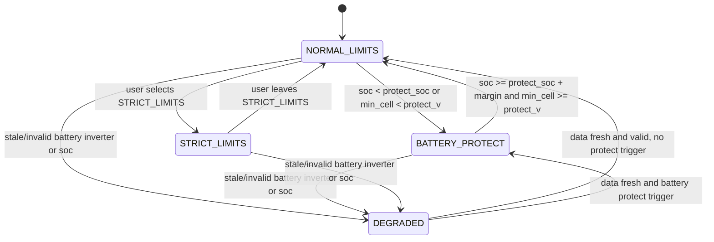
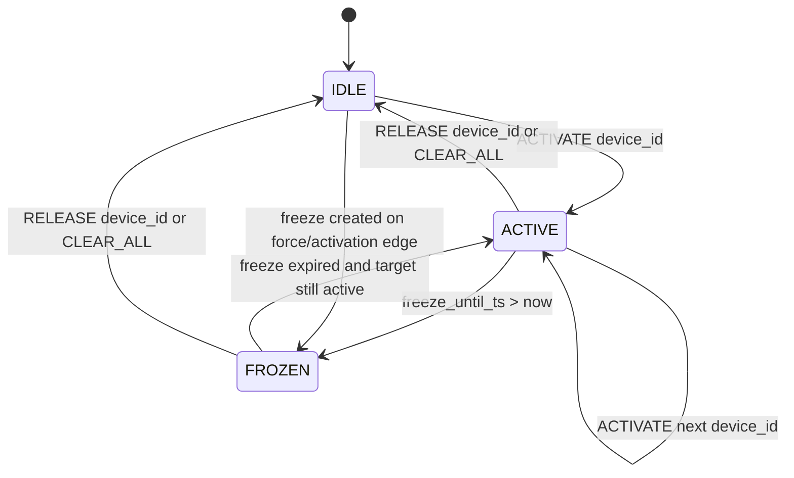
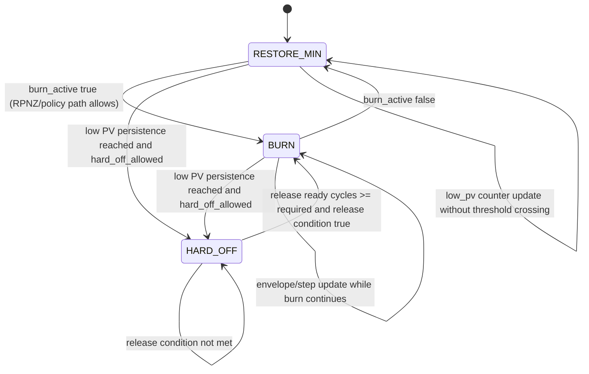
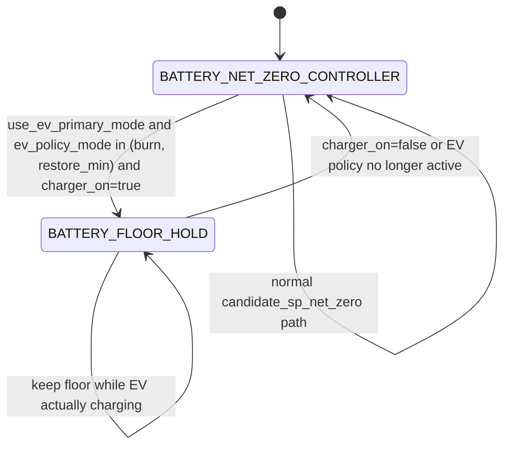

# EMS Tilakaavio

Tama dokumentti kokoaa yhteen EMS:n keskeiset tilasiirtymat:

1. Guard-profiilien operaatiotilat
2. Surplus-dispatch-statejen paasiirtymat
3. EV policy anti-flap/hard_off -tilasiirtymat
4. EV-primary + battery-target authority -siirtymat

## 1) Guard-tilojen kaavio

Tulkitse kaavio nain:

1. `DEGRADED` on data-validiteettiin sidottu turvallisuustila.
2. `BATTERY_PROTECT` on akkukemiaan sidottu suojatila.
3. `STRICT_LIMITS` on kayttajan pakottama rajoitustila.
4. `NORMAL_LIMITS` on perusoptimointitila.

## 2) Surplus-dispatch-statejen kaavio

Tulkitse kaavio nain:

1. `ACTIVATE` nostaa kanonisen `device_id`-kohteen aktiiviseksi.
2. `RELEASE` ja `CLEAR_ALL` pudottavat aktiivisuuden.
3. `FROZEN` estaa uusia aktivointeja freeze-ikkunan ajan.
4. Freeze voi syntya force- tai aktivointireunasta.

## 3) EV policy anti-flap / hard_off -kaavio

Tulkitse kaavio nain:

1. `RESTORE_MIN` on anti-flap valitila ennen mahdollista hard_offia tai burnia.
2. `HARD_OFF` pysyy aktiivisena kunnes release-ehdot tayttyvat (PV + RPC + hysteresis-syklit).
3. `BURN` on aktiivinen EV-ohjauspolku, jossa EV-current paivittyy envelope/step-saantojen mukaan.

## 4) EV-primary ja battery-target authority -kaavio

Tulkitse kaavio nain:

1. EV-primary ei yksin riita lukitsemaan battery flooria, vaan toteutunut lataustila (`charger_on`) ratkaisee restore_min-haaran.
2. `restore_min + charger_on=false` sallii battery-targetin jatkaa normaalia NET_ZERO-saatoa.
3. `restore_min + charger_on=true` aktivoi floor-hold -kayttaytymisen.

## Kaavioiden suhde pipelineen

EMS-ketju etenee aina jarjestyksessa:

1. policy engine
2. dispatch state applier
3. actuator writer loop

Siksi tilasiirtyma ja actuator-muutos eivat aina nay samassa 30 s stepissa.

Huomio aikajarjestykseen:

1. Policy tuottaa saman syklin aikana seka dispatch-paatoksen etta policy-targetit.
2. Dispatch state applier paivittaa aktiivisuusstateja/freezea.
3. Writer paivittaa fyysiset actuatorit, jolloin havaittava laitetila voi muuttua vasta ketjun viimeisessa vaiheessa.

Lisalukeminen:

1. `docs/dev/ems_step_model.md`
2. `docs/dev/arkkitehtuuri.md`
3. `docs/user/operointi.md`
