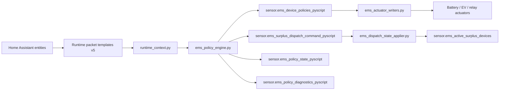

# EMS-arkkitehtuuri

## Canonical tuotantoketju



Runtime lukee kolme strict pakettia:

```text
sensor.ems_policy_config_runtime
sensor.ems_measurements_runtime
sensor.ems_policy_state_runtime
```

Schema on 5. Puuttuva pakollinen kenttä failaa suljetusti.

## Device model

Canonical rakenne on `devices[device_id]`. Device-ID omistaa kindin, capabilityt, policyt, lifecycle-stateen liittyvät arvot, final `DevicePolicy`n ja actuator-mappingin.

Core ei valitse ensimmäistä akkua tai EV:tä implisiittisesti. Primary fallback tapahtuu vain konfiguroidussa järjestyksessä.

## Roolit

```text
configured primary candidates = 0..N
effective primary = 0..1 per tick
producer pool = 0..N
surplus pool = 0..N
```

Primary-, producer- ja surplus-prioriteetit ovat eri käsitteitä.

## Quarter-derivointi

```text
remaining_quarter_s = seconds_until_next_quarter(now)
control_horizon_s = max(remaining_quarter_s, 30)
target_grid_w = -(quarter_energy_balance_kwh × 3 600 000 / control_horizon_s)
rpnz_w = round(target_grid_w)
rpc_w = round(target_grid_w - grid_power_w)
```

`remaining_quarter_min` on vain `remaining_quarter_s / 60` -diagnostiikka.

RPC:ssä on lisäksi kiinteä `quarter_energy_balance_kwh >= 0.130 → 0 W` -suojapolku. Se on dokumentoitu käyttäjän tunnetuissa rajoitteissa eikä sitä pidä tulkita yleiseksi kaavaksi.

## Shared feedback ja primary resolver

```text
error_w = rpnz_w - grid_power_w
delta_w = error_w / 2
desired_target_w = current_authority_target_w + quantized(delta_w)
```

Resolveri käy `primary_consuming_device_ids`-listan. Tyypillisiä skip-syitä ovat lifecycle HARD_OFF, producer feedback protection, alle-minimipyyntö ja capability unavailable.

Ensimmäinen toteutuskelpoinen kandidaatti saa authorityn. Muutoin `unserved_primary_consuming_w` raportoi toteutumattoman tarpeen.

## Device-specific realization

- EV: W → A, min-current, phases, voltage, step ja HARD_OFF lifecycle
- battery: signed W, charge/discharge capabilityt ja guardit
- relay: binary fixed dispatch; ei nykyisessä contractissa primary-regulatori

## Surplus ja producer

Effective primary poistetaan surplus-poolista saman tickin ajaksi. Surplus allocator ohittaa `activation_allowed=false`-kandidaatin ja vapauttaa aktiivisen unavailable-laitteen.

Negatiivinen desired signed target muuttuu producer-requestiksi. Producerit käsitellään `producing_priority`-järjestyksessä hard ceilingien, minimin ja stepin sisällä.

## Policy State

Persistoitava continuity sisältää vain seuraavien ajojen päätöksentekoon tarvittavaa statea. EV:n `low_pv_cycles` saturoituu HARD_OFF-kynnykseen; release-counter etenee vain palautumisehdon aikana.

## Writer

```text
DevicePolicy[device_id]
→ entity_registry.devices[device_id]
→ kind-specific writer
→ Home Assistant service call
```

Writer ei käytä diagnosticsia command fallbackina.

## Julkaisut

- DP: final DevicePolicy-kokoelma
- DC: surplus dispatch command
- PS: continuity state
- diagnostics: canonical-muutoksesta tai interval-heartbeatista

Change detectionin pitää perustua canonical semantiikkaan, ei joka tickillä muuttuviin suorituskykymittareihin.
