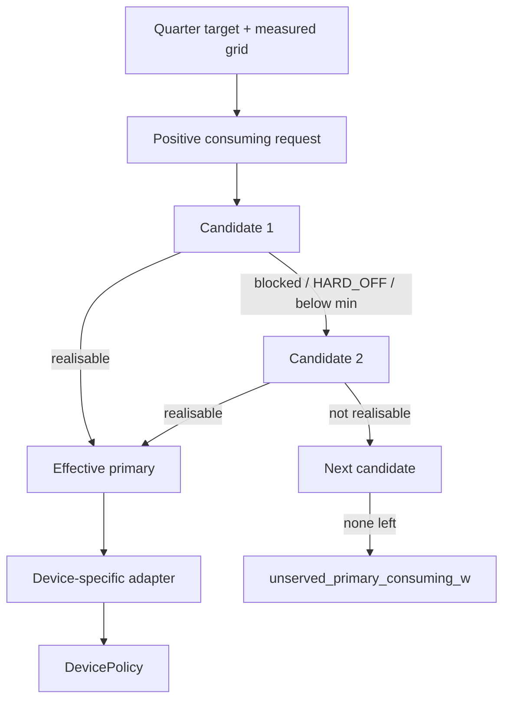
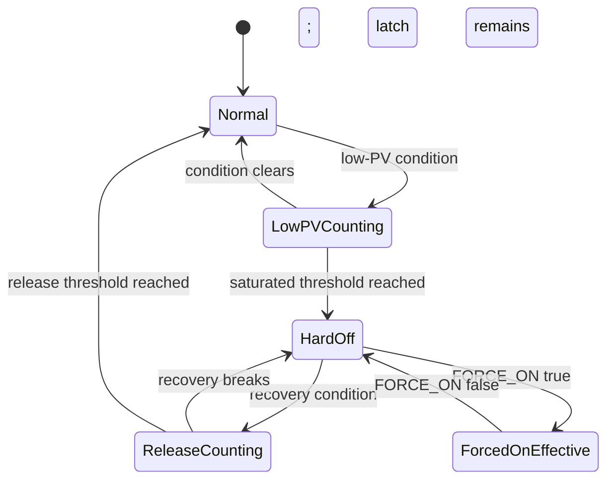
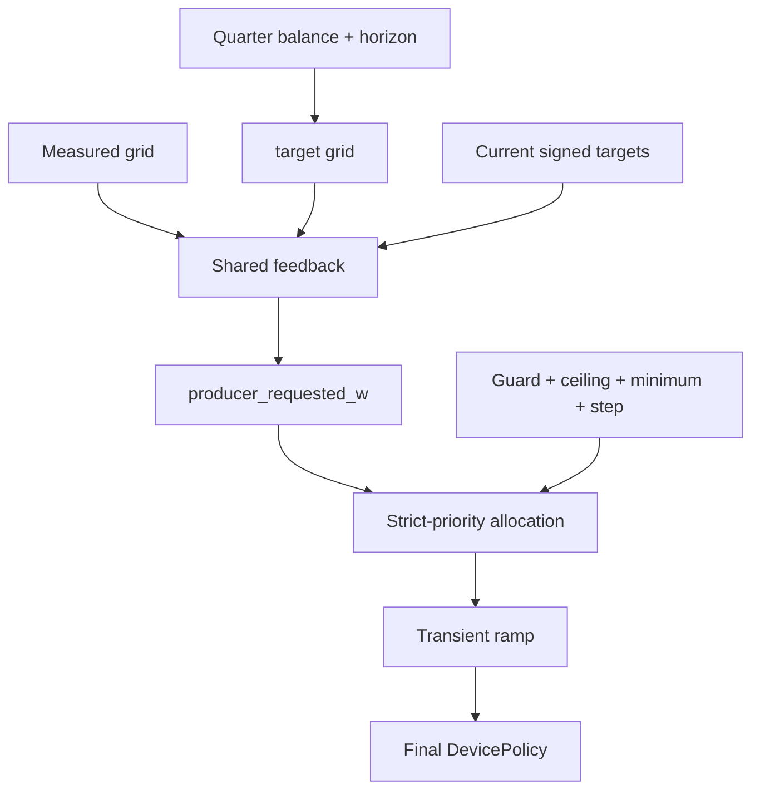
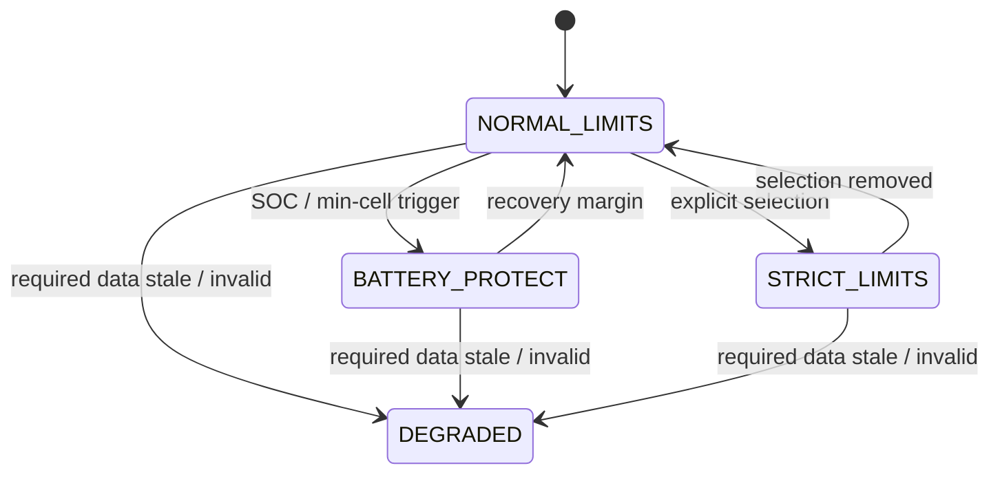
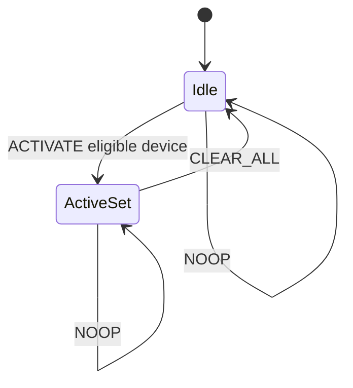

# EMS-tilakaaviot

## Primary-consuming resolver

```mermaid
flowchart TD
    Q[Quarter target + measured grid] --> R[Positive consuming request]
    R --> C1[Candidate 1]
    C1 -->|realisable| E[Effective primary]
    C1 -->|blocked / HARD_OFF / below min| C2[Candidate 2]
    C2 -->|realisable| E
    C2 -->|not realisable| CN[Next candidate]
    CN -->|none left| U[unserved_primary_consuming_w]
    E --> A[Device-specific adapter]
    A --> P[DevicePolicy]
```

Effective primary ei ole saman tickin surplus-kandidaatti.

## EV lifecycle

```mermaid
stateDiagram-v2
    [*] --> Normal
    Normal --> LowPVCounting: low-PV condition
    LowPVCounting --> Normal: condition clears
    LowPVCounting --> HardOff: saturated threshold reached
    HardOff --> ReleaseCounting: recovery condition
    ReleaseCounting --> HardOff: recovery breaks
    ReleaseCounting --> Normal: release threshold reached
    HardOff --> ForcedOnEffective: FORCE_ON true
    ForcedOnEffective --> HardOff: FORCE_ON false; latch remains
```

## Producer pipeline

```mermaid
flowchart TD
    Q[Quarter balance + horizon] --> T[target grid]
    G[Measured grid] --> F[Shared feedback]
    T --> F
    C[Current signed targets] --> F
    F --> P[producer_requested_w]
    P --> A[Strict-priority allocation]
    H[Guard + ceiling + minimum + step] --> A
    A --> TR[Transient ramp]
    TR --> D[Final DevicePolicy]
```

## Guardit

```mermaid
stateDiagram-v2
    [*] --> NORMAL_LIMITS
    NORMAL_LIMITS --> BATTERY_PROTECT: SOC / min-cell trigger
    BATTERY_PROTECT --> NORMAL_LIMITS: recovery margin
    NORMAL_LIMITS --> STRICT_LIMITS: explicit selection
    STRICT_LIMITS --> NORMAL_LIMITS: selection removed
    NORMAL_LIMITS --> DEGRADED: required data stale / invalid
    BATTERY_PROTECT --> DEGRADED: required data stale / invalid
    STRICT_LIMITS --> DEGRADED: required data stale / invalid
```

## Surplus dispatch

```mermaid
stateDiagram-v2
    [*] --> Idle
    Idle --> ActiveSet: ACTIVATE eligible device
    ActiveSet --> ActiveSet: ACTIVATE next eligible
    ActiveSet --> ActiveSet: RELEASE lowest-priority or unavailable
    ActiveSet --> Idle: CLEAR_ALL
    Idle --> Idle: NOOP
    ActiveSet --> ActiveSet: NOOP
```
