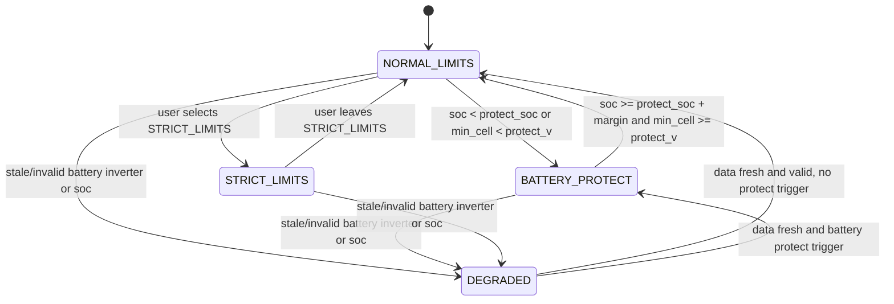
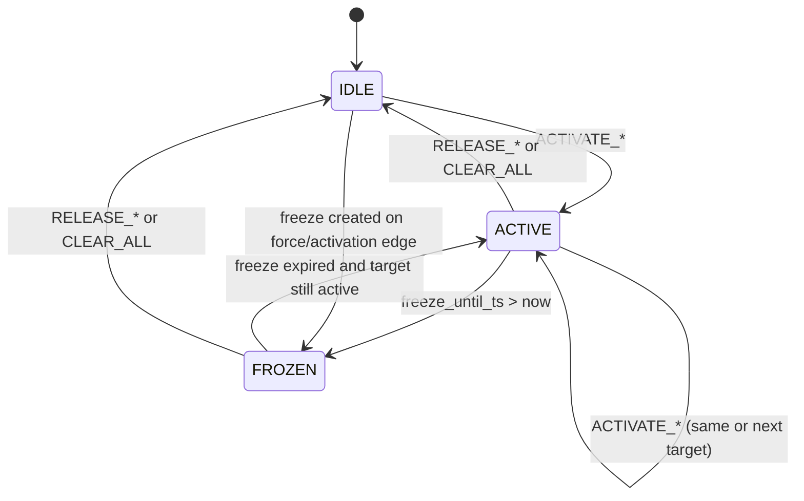

# EMS Tilakaavio

Tama dokumentti kokoaa yhteen kaksi asiaa:

1. Guard-profiilien operaatiotilat
2. Surplus-dispatch-statejen paasiirtymat

## 1) Guard-tilojen kaavio

Tulkitse kaavio nain:

1. `DEGRADED` on data-validiteettiin sidottu turvallisuustila.
2. `BATTERY_PROTECT` on akkukemiaan sidottu suojatila.
3. `STRICT_LIMITS` on kayttajan pakottama rajoitustila.
4. `NORMAL_LIMITS` on perusoptimointitila.

## 2) Surplus-dispatch-statejen kaavio

Tulkitse kaavio nain:

1. `ACTIVATE_*` nostaa kohteen aktiiviseksi.
2. `RELEASE_*` ja `CLEAR_ALL` pudottavat aktiivisuuden.
3. `FROZEN` estaa uusia aktivointeja freeze-ikkunan ajan.
4. Freeze voi syntya force- tai aktivointireunasta.

## Kaavioiden suhde pipelineen

EMS-ketju etenee aina jarjestyksessa:

1. policy engine
2. dispatch state applier
3. actuator applier

Siksi tilasiirtyma ja actuator-muutos eivat aina nay samassa 30 s stepissa.

Lisalukeminen:

1. `ems_step_model.md`
2. `arkkitehtuuri.md`
3. `operointi.md`
